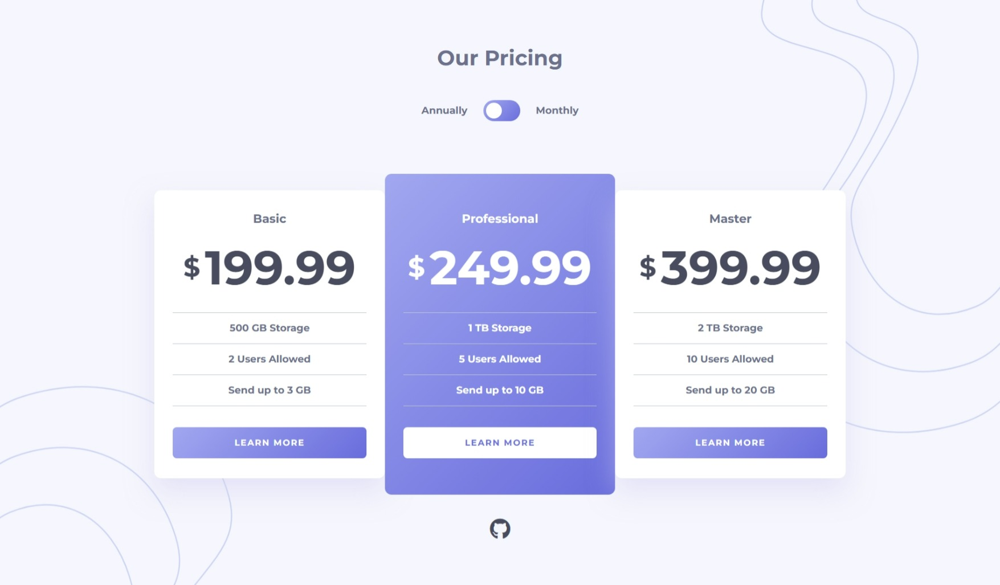

# Pricing Component

## Links:
- [Challenge Link](https://www.frontendmentor.io/challenges/pricing-component-with-toggle-8vPwRMIC)
- [Site Preview](https://robinjmm-pc.vercel.app/)

## About
This is my solution for the Pricing Component with Toggle challenge from [Frontendmentor.io](https://frontendmentor.io).

## User Stories
- View the optimal layout for the component depending on their device's screen size
- Control the toggle with both their mouse/trackpad and their keyboard

## Built with
- HTML5
- CSS3
- SASS
- PostCSS
- JavaScript
- Vite

## Acknowledgement
I'm very grateful to the people at [Frontendmentor.io](https://frontendmentor.io) for providing designs and challenges that help me improve my skills as a web developer.
